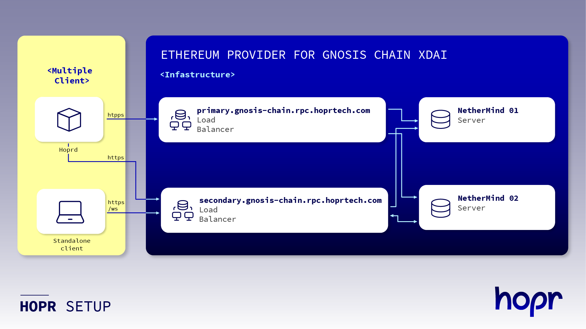

Ethereum provider
=========

This repository provides ansible playbooks to install and Ethereum provider. The Ethereum provider can work with Gnosis XDai or Goerli networks. 
[Hoprnet](https://hoprnet.org/) has deployed this repository into his infrastructure and it is available publicly to anyone at these endpoints:
* https://primary.gnosis-chain.rpc.hoprtech.com
* https://secondary.gnosis-chain.rpc.hoprtech.com
* https://primary.goerli-chain.rpc.hoprtech.com
* https://secondary.goerli-chain.rpc.hoprtech.com


This ansible playbook uses an [HAProxy](http://www.haproxy.org/) to provide SSL frontends and load balancing across multiple [Nethermind Ethereum](https://nethermind.io) clients that are in charge of synchronizing the Gnosis Chain network.

The [Hoprnet](https://github.com/hoprnet/hoprnet) protocol is already using these ethereum provider endpoints and has no dependenecy with other third party providers.


Architecture
------------
The next diagram shows the infrastructure example that is deployed for Gnosis XDai. 



An equivalent infrastructure has been deployed to Goerli

Test endpoints
------------

Gnosis XDai
```
curl -H "Origin: http://primary.gnosis-chain.rpc.hoprtech.com" -X POST --data '{"jsonrpc":"2.0","method":"eth_chainId","params":[],"id":67}' https://primary.gnosis-chain.rpc.hoprtech.net
```
```
curl -H "Origin: http://secondary.gnosis-chain.rpc.hoprtech.com" -X POST --data '{"jsonrpc":"2.0","method":"eth_chainId","params":[],"id":67}' https://secondary.gnosis-chain.rpc.hoprtech.net
```

Goerli
```
curl -H "Origin: http://primary.goerli-chain.rpc.hoprtech.com" -X POST --data '{"jsonrpc":"2.0","method":"eth_chainId","params":[],"id":67}' https://primary.goerli-chain.rpc.hoprtech.net
```
```
curl -H "Origin: http://secondary.goerli-chain.rpc.hoprtech.com" -X POST --data '{"jsonrpc":"2.0","method":"eth_chainId","params":[],"id":67}' https://secondary.goerli-chain.rpc.hoprtech.net
```

License
-------

MIT


